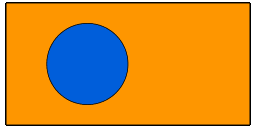
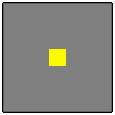

Animations in Chalk.

⚠️ Work in progress

Current example:

```python
from colour import Color
from chalk import circle, rectangle

from animation.core import constant, animation, render_gif
from animation.active import stretch

papaya = Color("#ff9700")
blue = Color("#005FDB")

obj = circle(1).fill_color(blue)
frame = rectangle(6, 3).fill_color(papaya)

anim = constant(frame) + animation(lambda t: obj.translate(2 * t - 1, 0))
anim = stretch(anim, 3)
render_gif(anim, "examples/output/demo.gif", 24)
```



For a more elaborate example, see [`examples/pythagoras.py`](examples/pythagoras.py).

